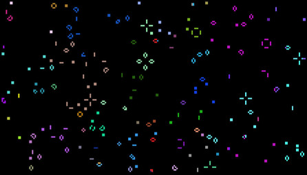

# nlife-color

This is a simple browser-based version of [Conway's Game of Life](https://en.wikipedia.org/wiki/Conway%27s_Game_of_Life) with the rules modified slightly to add color.

Run a live version [HERE.](http://www.node99.net/content/color_life/index.html)

## Rule Changes

To keep with the simplicity of Life, only two rules were added:

* When generating the initial board, colors are randomly assigned to all live cells.
* When a new cell is created, it inherits the most prevalent surrounding color.  In the event of a tie, any of the tied colors may be chosen.

There is no filtering of colors, so dark cells may exist that match the background.

## Overview

This code from this is taken from an old implementation of Life I had made called nLife.  It was browser based and had support for drawing patterns, controlling the speed, and saving states.  This predated the canvas tag, and instead used a grid of DIV elements.  Back then, there was a huge collection of interesting state files for Life floating around.  A version of nLife existed that allowed importing those files to explore the various patterns and machines.  Unfortunately, the author of the state files never responded to email asking for permission to use them, and so the full version was never released.

Around 2011, I modified nLife to use the canvas tag and while doing so made the changes to add colors.  With the simple rule change, the Life board filled with colored sections that would fight against each other.  I thought this was neat and released the source back then.   Coming across the code again recently, it seemed like it might be worth sharing on GitHub in case other people find it interesting or want to take it further.
